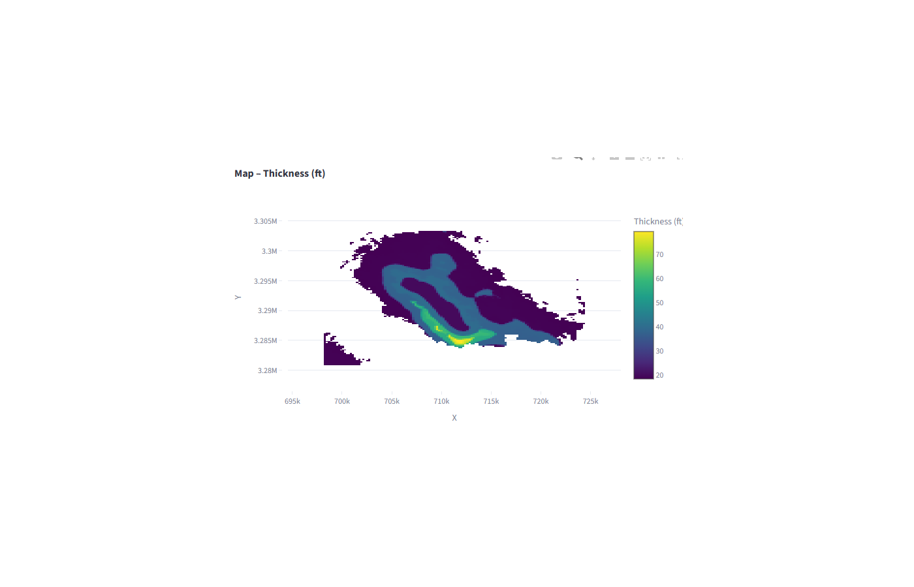
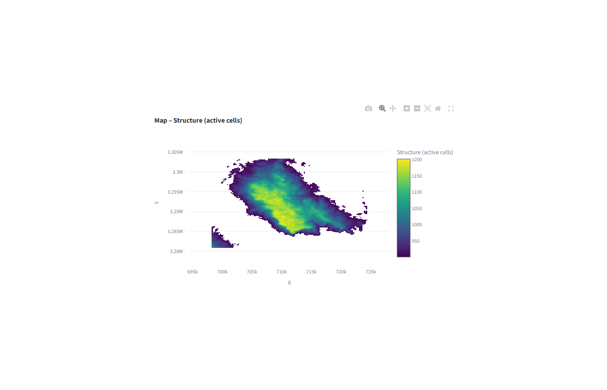
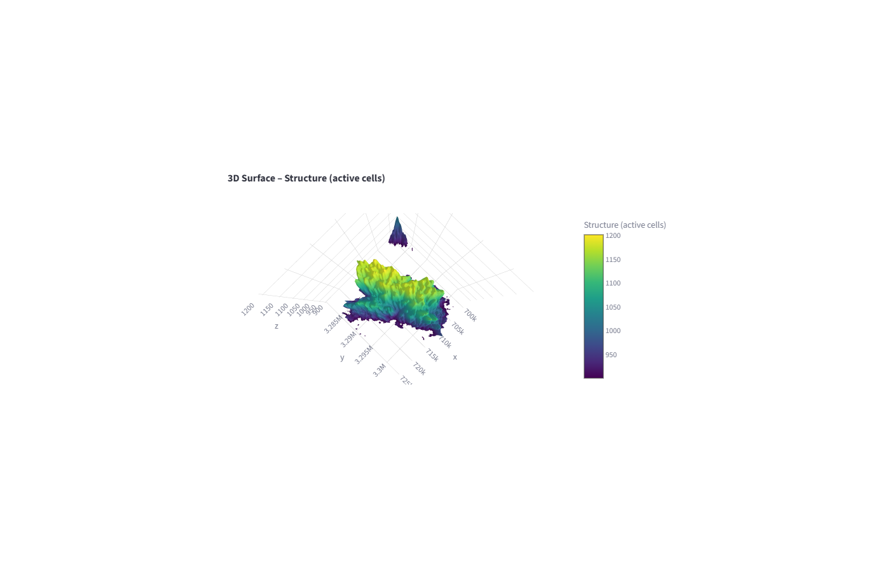
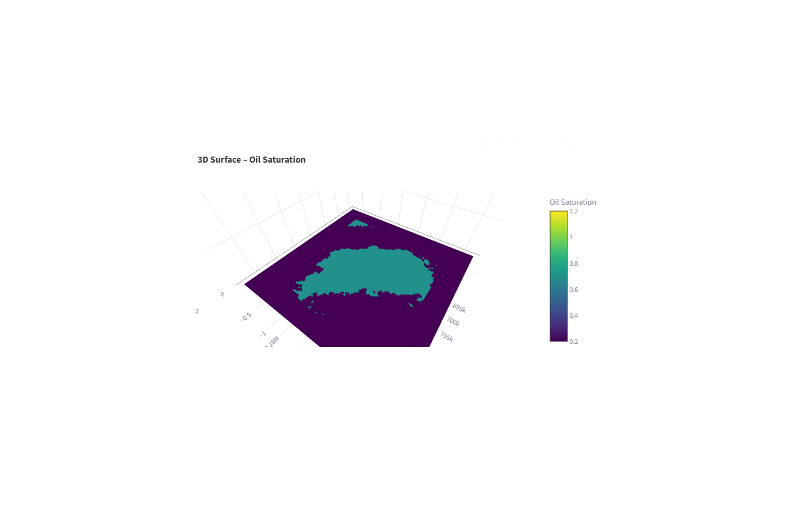
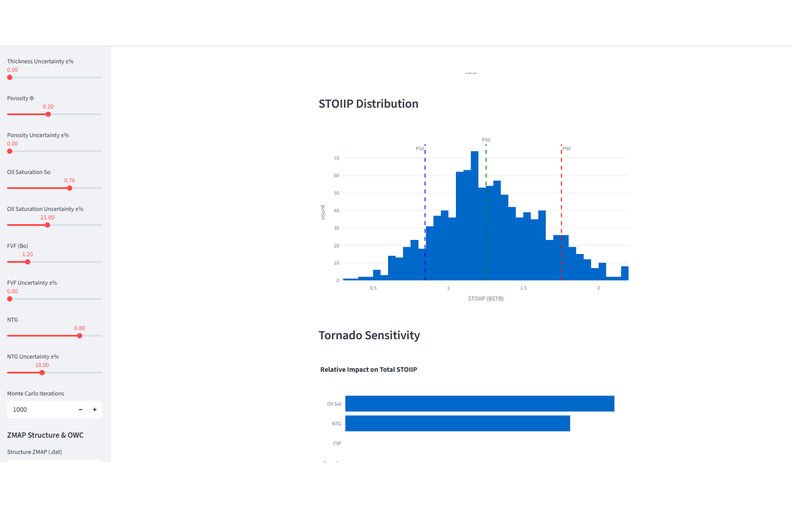
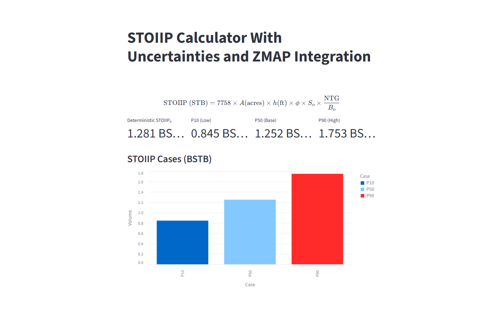

# STOIIP Monte Carlo Streamlit App

Streamlit application for STOIIP volumetric estimation with uncertainty and optional ZMAP grid inputs.

## Screenshots

<!-- screenshots:start -->














<!-- screenshots:end -->


## Repository Status

Private review draft. This repository was staged from a private working folder for review before any public publishing decision.

## What This Demonstrates

- Domain-focused analytical thinking
- Python/Jupyter workflow development
- Data cleaning and transformation
- Visualization and interpretation
- Reproducible project packaging

## Data And Privacy

Sample ZMAP files may contain private field references. Review before public release.

The files in this staged repository have been mechanically cleaned where possible:

- Jupyter checkpoint folders were removed.
- Absolute local paths were scrubbed from text files and notebooks.
- Notebook error outputs were removed.
- Risky or likely third-party binary files were excluded and listed in `EXCLUDED_FILES.csv`.

## Output Policy

Notebook outputs are intentionally not all cleared in this private review draft. Useful plots and tables can make the project understandable, but outputs must be reviewed before public release. For public repositories, the preferred approach is:

1. Keep a clean, rerunnable notebook.
2. Export selected sanitized plots to `assets/`.
3. Show the best 2-4 figures in this README.
4. Clear notebook outputs only when they expose private data, private paths, excessive raw tables, or execution noise.

## Run Locally

```bash
python -m venv .venv
pip install -r requirements.txt
jupyter lab
```

For Streamlit apps:

```bash
streamlit run app.py
```

## Review Checklist Before Public Release

- [ ] Confirm all data is public, synthetic, or approved for sharing.
- [ ] Confirm outputs do not expose private field names, coordinates, paths, UWIs, or production records.
- [ ] Replace placeholder paths with relative paths or sample data paths.
- [ ] Rerun notebooks from top to bottom.
- [ ] Export the best sanitized figures into `assets/`.
- [ ] Choose the final license.
