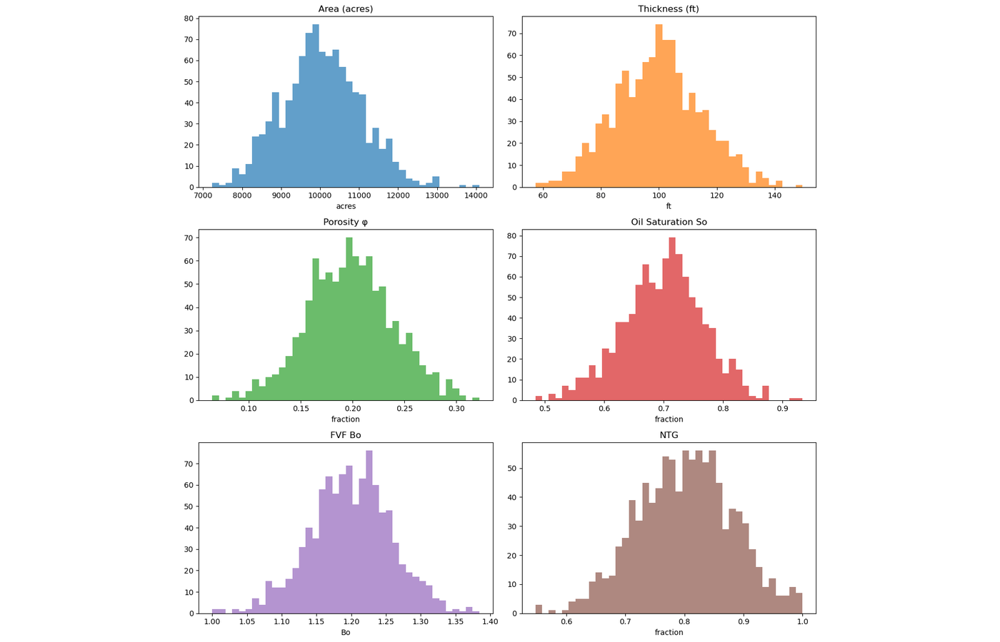
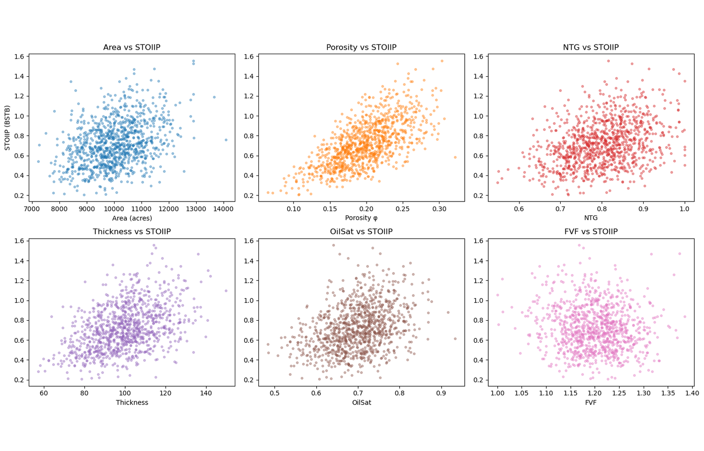
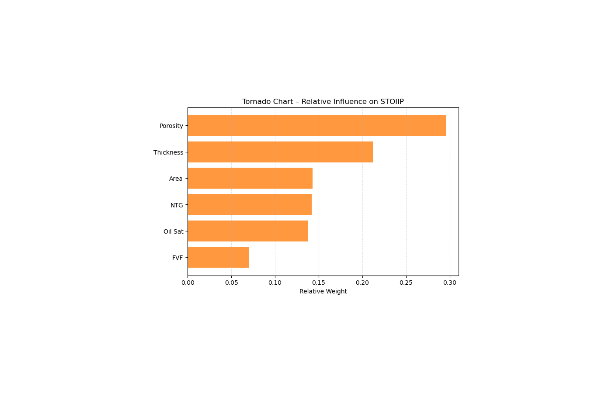

# STOIIP Monte Carlo Study

This repository contains a notebook-led study of STOIIP uncertainty. It samples area, thickness, porosity, oil saturation, net-to-gross and formation volume factor, then compares the deterministic estimate with the simulated distribution.

The notebook also looks at which inputs drive the spread through a tornado chart, correlation plots and a porosity-uncertainty sensitivity test. The values are illustrative and use a fixed random seed so the example can be repeated.

## Current status

The Monte Carlo notebook is the working part of this repository. `app.py` and `run_app.bat` are placeholders for a future Streamlit interface; a functioning app is not included yet. The sample ZMAP files are retained for planned grid-input work and are not connected to the placeholder interface.

## Selected outputs







## Run the notebook

```bash
python -m venv .venv
pip install -r requirements.txt
jupyter lab
```

Open `notebooks/STOIIP_Calculation_Explained.ipynb` and run the cells in order. This is an analytical example, not a reserves estimate or a substitute for asset-specific uncertainty work.
